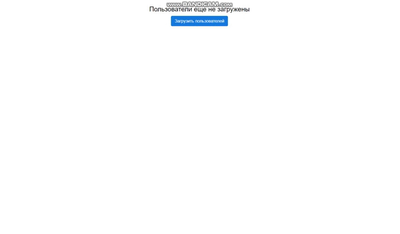

# Тестовое задание для Wuzzup24

Создан компонент таблицы с возможностью задания любых полей. Таблица имеет поиск по полям, а также пагинацию. Также реализована Pop-up форма. Запрос оформлен по XHR и промиса для того чтобы показать понимание этих механизмов в нативном JS. 

